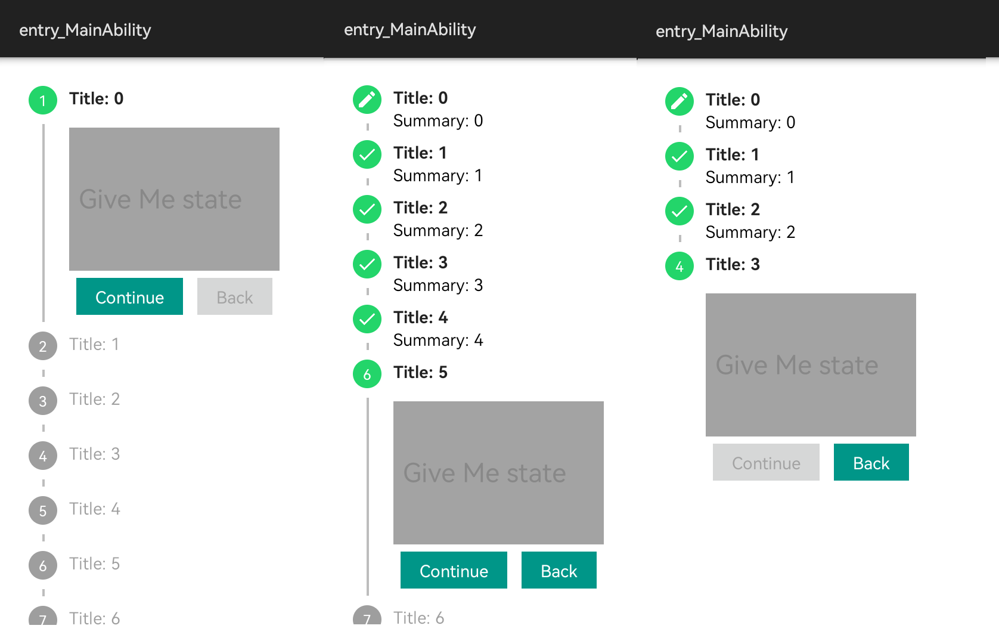

# HMOS Vertical Stepper View
> A vertical stepper implementation of the [material design specification][1]


### Screenshot


## Feature Overview

- Sticks closely to the [material design guidelines][1]
- Maintains state across configuration changes
- Allows to go back to completed steps
- Highly customizable (e.g. the navigation buttons are provided by the user)

The library is currently lacking animations between step transitions.

### Source
This library has been inspired by [liefery-it-legacy/android-vertical-stepper-view](https://github.com/liefery-it-legacy/android-vertical-stepper-view)


### Integration

**From Source**
1. For using HMOS-vertical-stepper-view module in sample app, include the source code and 
add the below dependencies in entry/build.gradle to generate hap/support.har.
```groovy
implementation project(path: ':vertical_stepper_view')
```

2. For using UniversalPickerDialog module in separate application using har file, add the har file in the entry/libs 
folder and add the dependencies in entry/build.gradle file.
```groovy
implementation fileTree(dir: 'libs', include: ['*.har'])
```
### Usage

Please take a look at the [sample][2] application.


### License
Please check the [LICENCE](LICENSE) file

[1]: https://material.io/archive/guidelines/components/steppers.html#
[2]: /entry/src/main/java/com/liefery/android/vertical_stepper_view/slice
